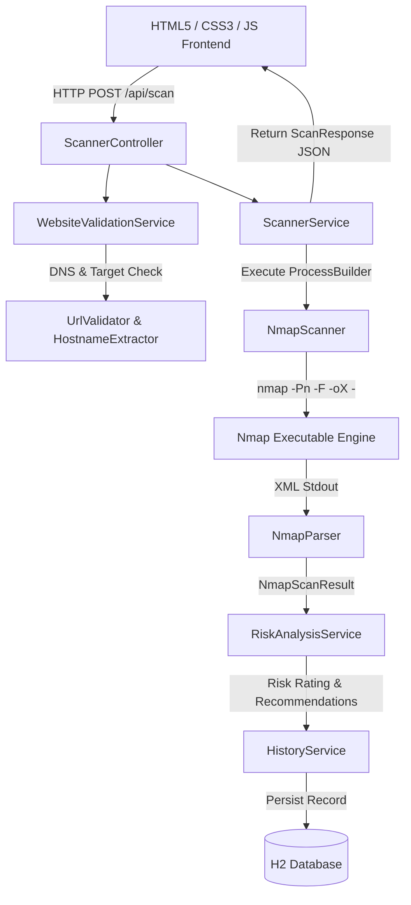

# SecureScan — Website Security Assessment Platform

[](https://www.oracle.com/java/)
[](https://spring.io/projects/spring-boot)
[](https://nmap.org/)
[](LICENSE)

**SecureScan** is an enterprise-grade Website Security Assessment platform built with Java, Spring Boot, Nmap, Spring Data JPA, and an HTML5/CSS3/JavaScript frontend. It enables network administrators, security analysts, and researchers to perform automated reconnaissance on public web targets, inspect exposed network services, evaluate operating system fingerprints, and receive rule-based risk recommendations.

---

## 🌟 Key Features

- 🎯 **5 Specialized Scan Profiles**: Supports `Quick Scan` (default), `Detailed Scan`, `Full Port Scan`, `OS Detection`, and `Aggressive Scan`.
- 🔒 **Input Security & Normalization**: Strips schemes (`https://`, `http://`) and paths for safe Nmap command-line target execution while preserving complete URL context on user reports.
- ⚡ **Direct Process Execution**: Executes Nmap via Java `ProcessBuilder` without unsafe shell wrappers (`cmd.exe`/`bash`), enforcing process timeouts and stream separation.
- 🧩 **Robust XML Parsing Engine**: Sanitizes Nmap XML output (`-oX -`) and parses host states, IP addresses, port states, protocols, service versions, and OS fingerprints.
- ⚖️ **Accurate Risk Semantics**: Prevents false `LOW RISK` declarations on inconclusive scans. Differentiates `COMPLETED`, `INCONCLUSIVE`, and `FAILED` assessment outcomes.
- 🎨 **WCAG AA Enterprise Dark UI**: Features a 4-state conditional frontend rendering engine with high-contrast typography, interactive profile warnings, and data tables.
- 💾 **Scan History Persistence**: Stores past security assessment reports in an in-memory H2 database via Spring Data JPA.

---

## 🏗️ System Architecture



---

## 📊 Supported Scan Profiles

| Profile Name | Nmap Arguments | Execution Timeout | Description | OS Fingerprinting |
| :--- | :--- | :--- | :--- | :--- |
| **Quick Scan** *(Default)* | `-Pn -F -oX -` | 30 seconds | Fast assessment of top 100 commonly exposed ports. | Not scanned |
| **Detailed Scan** | `-Pn -sV -oX -` | 60 seconds | Discovers open ports, service names, and version details. | Not scanned |
| **Full Port Scan** | `-Pn -p- -oX -` | 300 seconds | Comprehensive scan inspecting all 65,535 TCP ports. | Not scanned |
| **OS Detection** | `-Pn -O -oX -` | 120 seconds | Operating system fingerprinting attempt. | Attempted |
| **Aggressive Scan** | `-Pn -A -oX -` | 300 seconds | Advanced reconnaissance including service versions, OS, scripts, and traceroute. | Attempted |

---

## 💻 Tech Stack

- **Backend**: Java 17+, Spring Boot 4.1.0, Spring Data JPA, Hibernate ORM
- **Scanning Engine**: Nmap 7.80+
- **Database**: H2 In-Memory Database
- **Frontend**: HTML5, Vanilla CSS3 (Custom Dark Enterprise Design System), JavaScript (ES6+)
- **Testing**: JUnit 5, Mockito, Spring Boot Test

---

## 🚀 Getting Started

### Prerequisites

1. **Java Development Kit (JDK 17 or higher)**
   Verify Java installation:
   ```bash
   java -version
   ```

2. **Nmap (Network Mapper)**
   Ensure Nmap is installed and available on your system `PATH`:
   ```bash
   nmap --version
   ```
   *Windows Users*: Download Nmap from [nmap.org](https://nmap.org/download.html) and check **Add to PATH** during installation.

---

### Installation & Execution

1. **Clone Repository**
   ```bash
   git clone https://github.com/ianshul1025/SecureScan.git
   cd SecureScan
   ```

2. **Build Backend**
   ```bash
   cd backend
   ./mvnw clean package
   ```

3. **Run Application**
   ```bash
   ./mvnw spring-boot:run
   ```

4. **Access Web Application**
   Open your browser and navigate to:
   ```text
   http://localhost:8080/
   ```

---

## 🔌 API Reference

### 1. Execute Security Scan
- **Endpoint**: `POST /api/scan`
- **Content-Type**: `application/json`

**Request Payload:**
```json
{
  "url": "https://scanme.nmap.org",
  "scanProfile": "QUICK"
}
```

**Success Response (`200 OK`):**
```json
{
  "success": true,
  "message": "Security assessment completed",
  "data": {
    "url": "https://scanme.nmap.org",
    "status": "SUCCESS",
    "host": "scanme.nmap.org",
    "ipAddress": "45.33.32.156",
    "hostStatus": "UP",
    "assessmentStatus": "COMPLETED",
    "scanProfile": "QUICK",
    "scanProfileLabel": "Quick Scan — Recommended",
    "osStatus": "Not scanned",
    "os": "Not scanned",
    "scanDurationSeconds": 4.29,
    "scanTimestamp": "2026-07-31T00:05:00Z",
    "openPorts": [
      {
        "port": 22,
        "protocol": "TCP",
        "service": "ssh",
        "state": "open",
        "version": "—"
      },
      {
        "port": 80,
        "protocol": "TCP",
        "service": "http",
        "state": "open",
        "version": "—"
      }
    ],
    "riskAnalysis": {
      "riskLevel": "LOW",
      "summary": "Security assessment completed for target host scanme.nmap.org (45.33.32.156). Identified 2 open ports with an overall risk classification of LOW.",
      "recommendations": [
        "Port 80 (HTTP) exposed: Consider redirecting unencrypted HTTP traffic to HTTPS where appropriate.",
        "Port 22 (SSH) exposed: Enforce strong key-based authentication and limit SSH access to authorized management IP ranges."
      ]
    }
  }
}
```

---

### 2. Retrieve Scan History
- **Endpoint**: `GET /api/history`
- **Response**: Array of past security assessment summaries stored in H2 database.

---

## 🧪 Testing

Run the unit and integration test suite via Maven:

```bash
cd backend
./mvnw clean test
```

Test coverage includes:
- URL normalization & clean target hostname extraction
- XML stream parsing & stdout/stderr stream separation
- Nmap command generation & scan profile flags
- Assessment status semantics (`COMPLETED`, `INCONCLUSIVE`, `FAILED`)
- REST Controller endpoints & global exception handling

---

## 📄 License

Distributed under the MIT License. See `LICENSE` for details.
